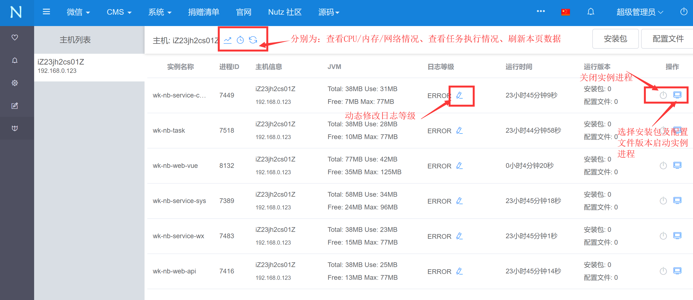
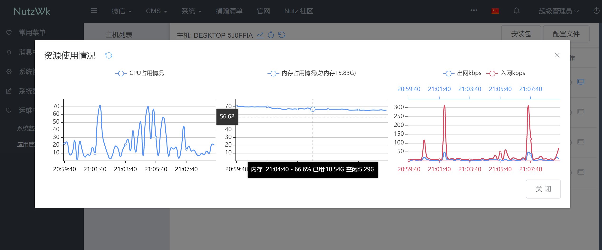

# budwk-daemon-python
BudWk 微服务开发框架应用守护进程 https://budwk.com

* 基于 Python 3.7.3+ 开发
* 支持 BudWk v6 
* 支持分布式部署

## QQ交流群
* 1群: 68428921 (已满)
* 2群: 24457628


## 使用说明

* 根据配置要求将jar包及配置文件置于指定文件夹
* 服务器的主机名不可重复
* `pip3 install psutil` 安装psutil模块，获取CPU、内存占用情况
* `nohup python server.py &` 启动守护进程
* wk-nb-web-admin/wk-nb-web-api-daemon/wk-nb-web-api-open 等web项目是需要占用端口的，在同台服务器上启动多个实例的话，需使用不同配置文件配置不同端口，可以用版本号区分，如 1.2-9001、1.2-9002
* wk-nb-web-api-daemon 默认端口 9001 是为守护进程通信用的，守护进程通过API获取任务和上报服务器资源占用情况

## 配置说明

* settings.py 配置文件内容
```python
#!/usr/bin/python
# -*- coding: utf-8 -*-
# 初始jar包及配置文件文件夹,jar文件及配置文件以实例名为文件名,文件名中不包含版本号
APP_JARS = 'D://data/jars/'
# 运行目录,不要手动创建,启动时判断目录是否存在来初始化项目
APP_ROOT = 'D://data/wk/'
# jar文件名,名称要保持与配置文件里 nutz.application.name 值一致
# 确保 wk-nb-service-sys 为第一个启动项目,其他模块功能都依赖它
APP_LIST = [
    'wk-nb-service-sys',
    'wk-nb-service-cms'
]
# jar包启动的jvm配置参数
APP_OPTS = {
    'wk-nb-service-sys': '-Xmx100m -Xms60m',
    'wk-nb-web-api-daemon': '-Xmx80m -Xms40m',
    'wk-nb-service-cms': '-Xmx80m -Xms40m',
    'wk-nb-service-wx': '-Xmx80m -Xms40m',
    'wk-nb-task': '-Xmx80m -Xms40m',
    'wk-nb-web-admin': '-Xmx150m -Xms80m'
}
# 通信密钥,保持与 wk-nb-web-api-daemon 模块里配置内容一致,用于心跳通信
HTTP_SECRET_ID = 'wizzer'
HTTP_SECRET_KEY = 'budwk'
# API路径
HTTP_URL = 'http://127.0.0.1:9001/open/api/deploy'
# 心跳周期(单位:秒)
HTTP_HEARTBEAT = 10
HTTP_TIMEOUT = 5

CACHE_TASK_IDS = []
CACHE_HOST_NAME = ''
```
* 初始化时 APP_JARS 文件列表示例
```text
    wk-nb-service-sys.jar
    wk-nb-service-sys.properties
```

## NutzWk 配置文件

```text
    #实例名称与打包成功后的jar文件名保持一致
    nutz.application.name=wk-nb-service-sys
    
    #动态修改日志等级,启用
    logback.exts.loglevel.enabled=true
    #心跳间隔(单位:秒)
    logback.exts.loglevel.heartbeat=10
    
    #为应用管理提供支持,启用获取部署版本号,结合守护进程使用
    logback.exts.deploy.enabled=true
    #为应用管理提供支持,部署根路径
    logback.exts.deploy.root=D://data/wk
```

## 管理后台界面




